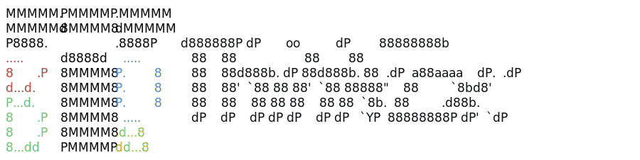

  <picture>
    <source media="(prefers-color-scheme: dark)" srcset="docs/assets/thinkex-filled-ascii-wordmark-dark.svg">
    <source media="(prefers-color-scheme: light)" srcset="docs/assets/thinkex-filled-ascii-wordmark-light.svg">
    
  </picture>

  
  
  

  <strong>The workspace built for how you study, research, and create.</strong>

  

## When a Chat Thread Is Not Enough

ThinkEx is a workspace for source-heavy study and research.

Instead of uploading sources into a chat, you keep the actual materials in view: PDFs, docs, images, folders, and AI chat. Arrange them, pick what the AI should use, and keep the answer tied to the workspace where the work is happening.

- Open PDFs, documents, images, and folders in a workspace.
- Put sources side by side while you read or compare them.
- Ask AI about the specific items you choose.
- Share a workspace with collaborators (fellow humans).

## How It Is Different

| Compared with           | What they are good at                    | Where ThinkEx differs                                     |
| ----------------------- | ---------------------------------------- | --------------------------------------------------------- |
| ChatGPT, Claude, Gemini | Fast AI conversations                    | Chat is part of the workspace, next to sources and docs   |
| NotebookLM              | Asking questions over uploaded sources   | Sources stay open, arrangeable, editable, and shareable   |
| Obsidian                | Markdown files and local knowledge bases | PDFs, images, docs, AI chat, and sharing are first-class  |
| Google Drive, Dropbox   | Storing and sharing files                | Files become source material with docs and AI beside them |

## Built On

ThinkEx is a full-stack TypeScript app on Cloudflare. The frontend is React, TanStack Start, Tailwind CSS, Tiptap, EmbedPDF/PDFium, Yjs, and AI SDK. The backend runs on Cloudflare Workers with Durable Objects, D1, R2, Workflows, Containers, Workers AI, Browser Rendering, and Email.

Technology stack

### Cloudflare

- **Workers** for the application server.
- **Durable Objects** for workspace, document, AI, sandbox, and conversion coordination.
- **D1** for relational app data with Drizzle migrations.
- **R2** for workspace file storage.
- **Workflows** for file extraction.
- **Containers** for code execution, office conversion, and image conversion.
- **Workers AI** and **AI Gateway** for model access.
- **Browser Rendering** for web browsing workflows.
- **Email** for workspace invites.
- **Observability** for logs, traces, and source maps.
- **Wrangler**, **Cloudflare Vite plugin**, and **Workers Vitest pool** for local runtime, deploys, types, and tests.

### App and UI

- **React 19**, **TanStack Start/Router/Query**, **TypeScript**, **Vite+**, and **Tailwind CSS v4**.
- **Base UI**, **lucide-react**, **motion**, **sonner**, and local shadcn-style components.
- **Tiptap 3**, **ProseMirror**, **Yjs**, **y-partyserver**, and **PartyServer** for collaborative documents.
- **EmbedPDF**, **PDFium**, **Photon**, **Gotenberg**, and image conversion containers for rich source handling.

### AI, data, and product systems

- **AI SDK**, **Cloudflare Think**, **Cloudflare Sandbox**, **Cloudflare Shell**, and **Cloudflare Codemode**.
- **Better Auth**, **Drizzle ORM**, **Zod**, **PostHog**, **The Context Company**, **Autumn**, **Firecrawl**, and **LlamaCloud** integrations.
- **Streamdown**, **KaTeX**, **Shiki**, **PapaParse**, **dnd-kit**, **react-resizable-panels**, and **Zustand** for workspace interactions.

See [`package.json`](package.json), [`wrangler.jsonc`](wrangler.jsonc), and [`docs/ENVIRONMENT.md`](docs/ENVIRONMENT.md) for deeper implementation details.

## Working With The Repo

This repository is the ThinkEx web app. If you want to run or contribute to it, start with:

- [`CONTRIBUTING.md`](CONTRIBUTING.md) for contribution expectations.
- [`docs/ENVIRONMENT.md`](docs/ENVIRONMENT.md) for local setup.

## License

ThinkEx is licensed under the [AGPL-3.0 License](LICENSE).
