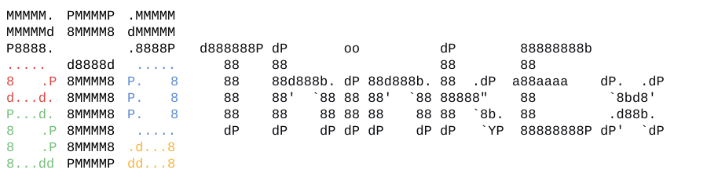
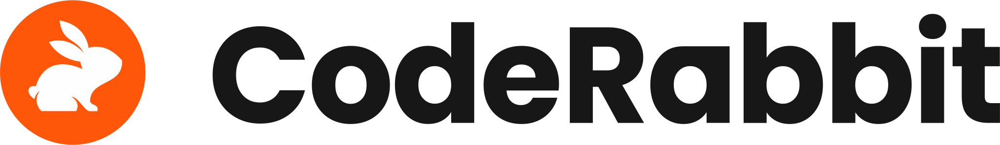

  <picture>
    <source media="(prefers-color-scheme: dark)" srcset="docs/assets/thinkex-filled-ascii-wordmark-dark.svg">
    <source media="(prefers-color-scheme: light)" srcset="docs/assets/thinkex-filled-ascii-wordmark-light.svg">
    
  </picture>

  
  
  
  

  <strong>The workspace built for how you study, research, and create.</strong>

  

## When a Chat Thread Is Not Enough

ThinkEx is a workspace for source-heavy study and research.

Instead of uploading sources into a chat, you keep the actual materials in view: PDFs, docs, images, folders, and AI chat. Arrange them, pick what the AI should use as context, and keep the work grounded in your actual materials.

- Open PDFs, documents, images, and folders in a workspace.
- Put sources side by side while you read or compare them.
- Ask AI about the specific items you choose.
- Share a workspace with collaborators (fellow humans).

## How It Is Different

| Compared with                | What they are good at                    | Where ThinkEx differs                                     |
| ---------------------------- | ---------------------------------------- | --------------------------------------------------------- |
| ChatGPT, Claude, Gemini      | Fast AI conversations                    | Chat is part of the workspace, next to sources and docs   |
| Gemini Notebook (NotebookLM) | Asking questions over uploaded sources   | Sources stay open, arrangeable, editable, and shareable   |
| Obsidian                     | Markdown files and local knowledge bases | PDFs, images, docs, AI chat, and sharing are first-class  |
| Google Drive, Dropbox        | Storing and sharing files                | Files become source material with docs and AI beside them |

## Built On

ThinkEx is a full-stack TypeScript app hosted on Cloudflare. The frontend is React, TanStack Start, Tailwind CSS, Tiptap, EmbedPDF/PDFium, Yjs, and AI SDK. The backend runs on Cloudflare Workers with Durable Objects, PlanetScale Postgres through Hyperdrive, R2, Workflows, Containers, Workers AI, Images, Browser Run, and Email.

Tech stack

### Cloudflare

- **Workers** for the application server.
- **Durable Objects** for realtime workspace, document, AI, sandbox, and conversion coordination.
- **PlanetScale Postgres** for relational and canonical workspace state, accessed through cache-disabled Hyperdrive and managed with Drizzle migrations.
- **R2** for binary workspace file storage, with presigned direct uploads over `aws4fetch`.
- **Workflows** for file extraction.
- **Containers** for code execution (Sandbox), office conversion (Gotenberg), and file processing (LiteParse).
- **Workers AI** and **AI Gateway** for model access.
- **Images** for image transforms and conversion.
- **Worker Loaders** for dynamic code execution behind Codemode.
- **Browser Run** for page reads, agent-driven CDP sessions, Live View, and human handoff.
- **Email** for workspace invites.
- **Observability** for logs, traces, and source maps.
- **Wrangler**, **Cloudflare Vite plugin**, and **Workers Vitest pool** for local runtime, deploys, types, and tests.

### App and UI

- **React 19**, **TanStack Start/Router/Query**, **TypeScript**, **Vite+**, and **Tailwind CSS v4**.
- **Base UI**, **lucide-react**, **motion**, **sonner**, and local shadcn-style components.
- **Tiptap 3**, **ProseMirror**, **Yjs**, **y-partyserver**, and **PartyServer** for collaborative documents.
- **EmbedPDF**, **PDFium**, **Gotenberg**, and **LiteParse** for rich source handling.
- **Content Collections** for the Markdown-backed blog.

### AI, data, and product systems

- **AI SDK**, **Cloudflare Think**, **Cloudflare Sandbox**, **Cloudflare Shell**, **Cloudflare Codemode**, and **Cloudflare Agents**.
- **MCP** via the **Model Context Protocol SDK** and **Better Auth OAuth provider**, so agents can drive workspaces.
- **Better Auth**, **Drizzle ORM**, **Zod**, **PostHog** (product analytics and LLM analytics), **The Context Company**, **Autumn** (plans, usage, and billing), **Firecrawl**, and **LlamaCloud** integrations.
- **Streamdown**, **KaTeX**, **Shiki**, **PapaParse**, **dnd-kit**, **react-resizable-panels**, and **Zustand** for workspace interactions.

### Toolchain

- **pnpm**, **Node 24**, and **Vite+** (`vp`) for dependency management, dev, build, lint, format, and test.
- **Vitest** with a browser-free node project and a **Workers** pool project.
- **Infisical** for shared secrets, **Drizzle Kit** for migrations, **knip** and **react-doctor** for dead code and React checks, and **commitlint** for conventional commits.

See [`package.json`](package.json), [`wrangler.jsonc`](wrangler.jsonc), and [`docs/ENVIRONMENT.md`](docs/ENVIRONMENT.md) for deeper implementation details.

## Supporters

Programs and platforms supporting ThinkEx with credits, tools, and infrastructure.

  <a href="https://capy.ai/"><picture><source media="(prefers-color-scheme: dark)" srcset="docs/assets/supporters/capy-wordmark-dark.svg"><source media="(prefers-color-scheme: light)" srcset="docs/assets/supporters/capy-wordmark-light.svg"></picture></a>
  &nbsp;&nbsp;&nbsp;&nbsp;
  
  &nbsp;&nbsp;&nbsp;&nbsp;
  <a href="https://www.thecontextcompany.com/"><picture><source media="(prefers-color-scheme: dark)" srcset="docs/assets/supporters/the-context-company-wordmark-dark.svg"><source media="(prefers-color-scheme: light)" srcset="docs/assets/supporters/the-context-company-wordmark-light.svg"></picture></a>

  <a href="https://posthog.com/"><picture><source media="(prefers-color-scheme: dark)" srcset="docs/assets/supporters/posthog-wordmark-dark.svg"><source media="(prefers-color-scheme: light)" srcset="docs/assets/supporters/posthog-wordmark-light.svg"></picture></a>
  &nbsp;&nbsp;&nbsp;&nbsp;
  <a href="https://mintlify.com/"><picture><source media="(prefers-color-scheme: dark)" srcset="docs/assets/supporters/mintlify-wordmark-dark.svg"><source media="(prefers-color-scheme: light)" srcset="docs/assets/supporters/mintlify-wordmark-light.svg"></picture></a>
  &nbsp;&nbsp;&nbsp;&nbsp;
  <a href="https://www.coderabbit.ai/"><picture><source media="(prefers-color-scheme: dark)" srcset="docs/assets/supporters/coderabbit-wordmark-dark.svg"><source media="(prefers-color-scheme: light)" srcset="docs/assets/supporters/coderabbit-wordmark-light.svg"></picture></a>

## Contributing

If you want to run or contribute to the ThinkEx web app, start with:

- [`CONTRIBUTING.md`](CONTRIBUTING.md) for contribution expectations.
- [`docs/ENVIRONMENT.md`](docs/ENVIRONMENT.md) for local setup.
